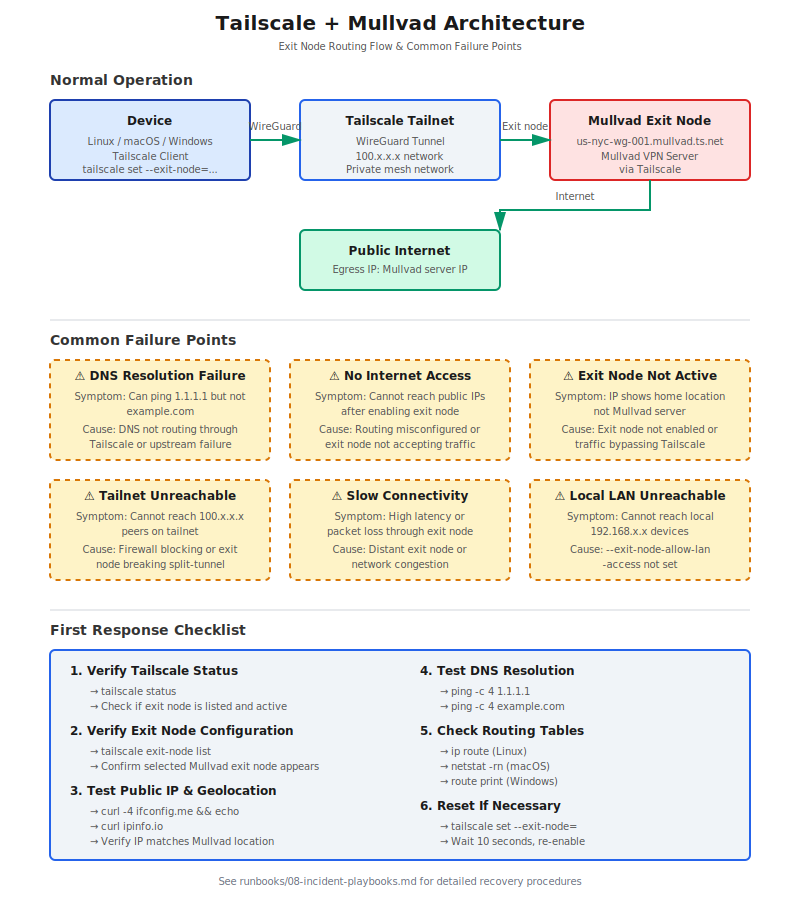

# Tailscale + Mullvad Runbooks

Practical runbooks for using **Tailscale with Mullvad VPN exit nodes** across Linux, macOS, and Windows.

This repository documents the official Tailscale + Mullvad integration where Mullvad VPN servers appear as **Tailscale exit nodes**. This is different from running the standalone Mullvad VPN app beside Tailscale.

---

## Why This Exists

This repository documents operational runbooks for configuring, validating, and troubleshooting Tailscale with Mullvad exit nodes across Linux, macOS, and Windows environments.

**The goal is to provide repeatable procedures for:**

- Private network access via Tailscale
- Exit-node routing through Mullvad VPN infrastructure
- DNS validation and routing verification
- Incident response for connectivity failures
- Cross-platform operational consistency

This repo serves as a working reference for operators managing secure, privacy-focused remote access infrastructure. It assumes operational responsibility for uptime, troubleshooting, and recovery—not just initial setup.

---

## Table of Contents

- [Purpose](#purpose)
- [What This Setup Does](#what-this-setup-does)
- [Key Concept](#key-concept)
- [Operational Scenarios Covered](#operational-scenarios-covered)
- [Requirements](#requirements)
- [Runbooks](#runbooks)
- [Quick Start](#quick-start)
- [Common Verification Flow](#common-verification-flow)
- [Architecture Overview](#architecture-overview)
- [Suggested GitHub Topics](#suggested-github-topics)
- [References](#references)

---

## Purpose

The purpose of this repo is to provide practical commands and troubleshooting steps for users who want to:

- Use Tailscale for private tailnet access
- Route public internet traffic through Mullvad VPN infrastructure
- Avoid dual-VPN client conflicts
- Switch between Mullvad exit-node locations
- Keep local LAN access when needed
- Troubleshoot DNS, routing, and connectivity problems

---

## What This Setup Does

This setup lets a device use Tailscale while routing public internet traffic through a Mullvad VPN exit node provided by Tailscale.

Basic flow:

```text
[Device: Linux/macOS/Windows]
        |
        | Tailscale WireGuard tunnel
        v
[Tailscale Tailnet]
        |
        | Selected Mullvad exit node
        v
[Mullvad VPN server provided through Tailscale]
        |
        v
[Public Internet]
```

---

## Key Concept

You are usually **not** running the standalone Mullvad VPN app and Tailscale at the same time.

Instead:

1. Tailscale manages access to Mullvad servers.
2. Mullvad servers appear as exit nodes in the Tailscale client.
3. Your device sends internet-bound traffic through the selected Mullvad exit node.
4. Your private tailnet access continues to work through Tailscale.

---

## Operational Scenarios Covered

This repository provides runbooks and incident response procedures for:

| Scenario | Coverage |
| --- | --- |
| **No internet after enabling exit node** | SEV1 incident playbook with step-by-step recovery |
| **DNS resolution failures** | Troubleshooting DNS leaks, upstream failures, and resolver conflicts |
| **Tailnet reachable but public internet fails** | Routing diagnostics and exit node validation |
| **Exit node enabled but traffic not routing through Mullvad** | IP verification, geolocation checks, and leak detection |
| **Device cannot reach other tailnet peers** | Split-tunnel diagnostics and firewall rule validation |
| **Slow or unstable connectivity** | Latency testing, exit node switching, and performance optimization |
| **Cross-platform deployment** | Consistent procedures for Linux, macOS, and Windows environments |
| **Reset and recovery** | Safe rollback procedures without losing tailnet access |

---

## Requirements

- Tailscale account
- Tailscale client installed
- Tailscale client version `1.48.2` or newer
- Mullvad VPN add-on purchased through Tailscale
- Device granted Mullvad access
- Admin/root privileges on the local machine

**Recommended Tailscale Version:**

Check version:

```bash
tailscale version
```

Recommended:

```text
Tailscale v1.48.3 or later
```

Using the newest stable version is recommended.

---

## Runbooks

| File | Purpose |
| --- | --- |
| [`runbooks/00-overview.md`](runbooks/00-overview.md) | Architecture, assumptions, limitations, operating model |
| [`runbooks/01-admin-console-setup.md`](runbooks/01-admin-console-setup.md) | Enable Mullvad in Tailscale admin console or policy file |
| [`runbooks/02-linux-runbook.md`](runbooks/02-linux-runbook.md) | Linux install, usage, verification, reset commands |
| [`runbooks/03-macos-runbook.md`](runbooks/03-macos-runbook.md) | macOS setup, GUI usage, CLI usage, reset commands |
| [`runbooks/04-windows-runbook.md`](runbooks/04-windows-runbook.md) | Windows setup, PowerShell usage, GUI usage, reset commands |
| [`runbooks/05-troubleshooting.md`](runbooks/05-troubleshooting.md) | Common failure modes and fixes |
| [`runbooks/06-privacy-security-notes.md`](runbooks/06-privacy-security-notes.md) | Privacy model, security considerations, operational notes |
| [`runbooks/07-command-reference.md`](runbooks/07-command-reference.md) | Quick command reference |
| [`runbooks/08-incident-playbooks.md`](runbooks/08-incident-playbooks.md) | Incident response playbooks for DNS, routing, exit node, and connectivity failures |

---

## Quick Start

List available Mullvad exit nodes:

```bash
tailscale exit-node list
```

Set a Mullvad exit node on Linux/macOS:

```bash
sudo tailscale set --exit-node=us-nyc-wg-001.mullvad.ts.net
```

Set a Mullvad exit node on Windows PowerShell:

```powershell
tailscale set --exit-node=us-nyc-wg-001.mullvad.ts.net
```

Set a Mullvad exit node and allow LAN access on Linux/macOS:

```bash
sudo tailscale set --exit-node=us-nyc-wg-001.mullvad.ts.net --exit-node-allow-lan-access=true
```

Set a Mullvad exit node and allow LAN access on Windows PowerShell:

```powershell
tailscale set --exit-node=us-nyc-wg-001.mullvad.ts.net --exit-node-allow-lan-access=true
```

Disable exit node on Linux/macOS:

```bash
sudo tailscale set --exit-node=
```

Disable exit node on Windows PowerShell:

```powershell
tailscale set --exit-node=
```

Check public IPv4:

```bash
curl -4 ifconfig.me && echo
```

Check public IP geolocation:

```bash
curl ipinfo.io
```

---

## Common Verification Flow

After enabling a Mullvad exit node, verify:

```bash
tailscale status
```

```bash
tailscale exit-node list
```

```bash
curl -4 ifconfig.me && echo
```

```bash
curl ipinfo.io
```

```bash
ping -c 4 1.1.1.1
```

```bash
ping -c 4 example.com
```

On Windows PowerShell:

```powershell
tailscale status
```

```powershell
tailscale exit-node list
```

```powershell
curl.exe -4 ifconfig.me
```

```powershell
curl.exe ipinfo.io
```

```powershell
ping 1.1.1.1
```

```powershell
ping example.com
```

---

## Architecture Overview

Visual representation of the Tailscale + Mullvad routing architecture and common failure points:



See [`docs/architecture-diagram.svg`](docs/architecture-diagram.svg) for detailed routing flow and troubleshooting decision tree.

---

## References

- Tailscale Mullvad exit nodes documentation: https://tailscale.com/docs/features/exit-nodes/mullvad-exit-nodes
- Tailscale + Mullvad product page: https://tailscale.com/mullvad
- Tailscale CLI discussion for best available Mullvad exit node: https://github.com/tailscale/tailscale/issues/11729
- Tailscale issue: no internet connectivity with Mullvad exit node: https://github.com/tailscale/tailscale/issues/10319
